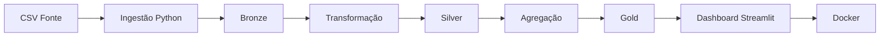

# 🏎️ F1 Data Analytics Pipeline

Projeto desenvolvido para implementação do ciclo de vida de Engenharia de Dados utilizando dados de Fórmula 1.

---

# Objetivo

Construir um pipeline ponta a ponta capaz de realizar:

* Ingestão de dados
* Armazenamento em camadas
* Transformação
* Orquestração
* Consumo analítico
* Containerização

O objetivo foi transformar dados brutos em informações prontas para análise.

---

# Arquitetura As-Built



---

# Estrutura do Projeto

```text
data/

bronze/
silver/
gold/

src/

ingestion/
transform/
storage/
serving/

logs/

main.py
dashboard.py
Dockerfile
requirements.txt
```

---

# Tecnologias Utilizadas

* Python
* Pandas
* Streamlit
* Docker
* GitHub
* CSV
* Mermaid

---

# Fluxo do Pipeline

CSV

↓

Ingestão (`ingest.py`)

↓

Bronze

↓

Transformação (`transform.py`)

↓

Silver

↓

Agregação (`gold.py`)

↓

Dashboard (`dashboard.py`)

↓

Docker

---

# Qualidade, Segurança e Governança

## Qualidade

* Limpeza de dados
* Tratamento de valores nulos
* Remoção de duplicatas

## Segurança

* Dependências controladas
* Ambiente isolado via Docker

## Governança

* Versionamento Git
* Estrutura organizada
* Pipeline reproduzível

## Monitoramento

* Logs automáticos
* Histórico de execução

---

# Mudanças em relação ao planejamento inicial

Durante a implementação ocorreram adaptações:

* Spark substituído por Pandas
* Airflow substituído por `main.py`
* PostgreSQL substituído por Data Lake local
* Streaming substituído por processamento batch
* Docker utilizado para garantir portabilidade

---

# Como Executar

Instalar dependências:

```bash
pip install -r requirements.txt
```

Executar pipeline:

```bash
python main.py
```

Subir dashboard:

```bash
docker build -t f1-pipeline .

docker run -p 8501:8501 f1-pipeline
```

Abrir:

```text
http://localhost:8501
```

---

# Resultado

Dashboard analítico contendo:

* Ranking de pilotos
* Ranking de equipes
* KPIs
* Estatísticas da temporada
* Dados processados em Gold
