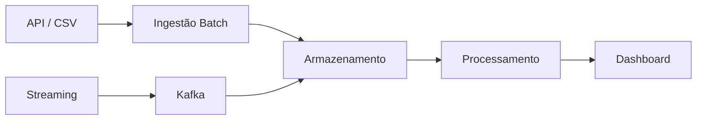

# F1-Data-Analytics-Pipeline
Este projeto tem como objetivo o planejamento de um pipeline de engenharia de dados aplicado ao contexto da Formula 1

A proposta consiste em integrar dados históricos e dados em tempo real (simulados), permitindo análise de desempenho de pilotos, equipes e corridas por meio de um fluxo estruturado de dados.

❗ Problema

Os dados da Fórmula 1 estão:

Distribuídos em múltiplas fontes
Em diferentes formatos (JSON, CSV)
Com diferentes frequências (batch e streaming)

Isso dificulta a análise integrada e a geração de insights consistentes.

🎯 Objetivos
Integrar dados batch e streaming
Estruturar e armazenar os dados
Permitir transformação e análise
Disponibilizar dados para dashboards

👥 Stakeholders
Analistas de dados esportivos
Fãs de Fórmula 1
Criadores de conteúdo
Equipes (simulado)

📊 Definição dos Dados
📦 Dados Batch
Resultados de corridas
Classificações
Tempos de volta
Dados de pilotos e equipes

Fontes:

API pública (ex: Ergast)
Arquivos CSV

Formato: JSON / CSV
Latência: Alta

⚡ Dados de Streaming
Velocidade
Posição na pista
Pit stops
Eventos de corrida

Fonte: Simulação (Python)
Formato: JSON
Latência: Baixa

🧩 Domínios e Serviços
Domínios
Corridas
Pilotos
Equipes
Telemetria
Analytics
Serviços
Ingestão de dados batch
Ingestão de streaming
Processamento de dados
Armazenamento
Consumo (dashboards/API)

🏗️ Arquitetura (Visão Geral)

O projeto segue uma abordagem inspirada em:

Arquitetura Lambda (batch + streaming)
Conceito de Data Lake

🔄 Fluxo de Dados

⚖️ Justificativa da Arquitetura

A arquitetura escolhida permite:

Processamento de dados históricos (batch)
Processamento de dados em tempo real (streaming)
Escalabilidade e separação de responsabilidades

⚙️ Tecnologias
🔹 Ingestão
API REST
Apache Kafka
🔹 Armazenamento
PostgreSQL
Data Lake (arquivos locais)
🔹 Processamento
Python (pandas)
Apache Spark (opcional)
🔹 Orquestração
Apache Airflow
🔹 Visualização
Power BI

🔐 Governança e DataOps
Versionamento com GitHub
Monitoramento por logs
Validação de dados
Controle básico de qualidade

⚠️ Riscos e Limitações
Dependência de APIs externas
Dados de streaming simulados
Limitações de hardware
Complexidade de ferramentas distribuídas

🚀 Próximos Passos
Implementar ingestão de dados
Criar banco de dados PostgreSQL
Desenvolver pipeline em Python
Simular streaming
Criar dashboards no Power BI

📚 Referências
Documentação de APIs de Fórmula 1
Documentação oficial das ferramentas
Conteúdo das aulas da disciplina
